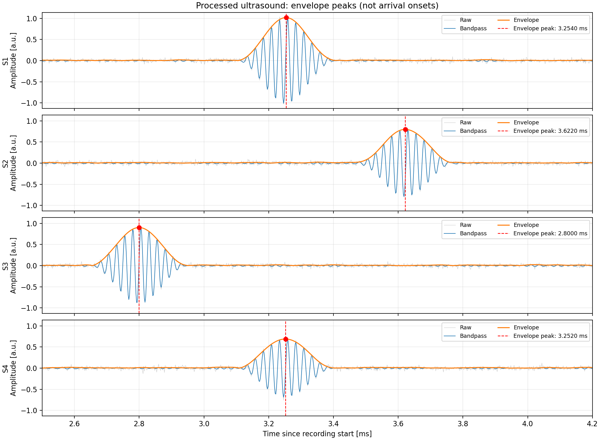
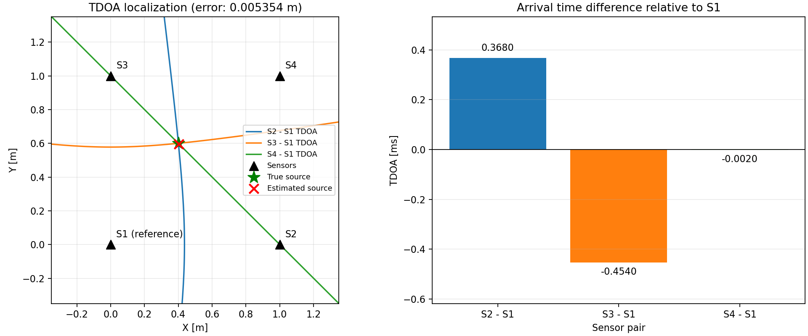

# TDOA 위치 추정 및 시각화

센서 4개의 초음파 파형에서 포락선 피크 시간차(TDOA)를 구해 음원의
2차원 위치를 추정합니다.

`tdoa.py`를 실행하면 다음 과정을 한 번에 처리합니다.

CSV 읽기 → 평균 제거 → 대역통과 필터 → 포락선 피크 검출 →
피크 시간차 계산 → 위치 추정 → 신호 및 위치 시각화.

- `tdoa.py`: 전체 실행과 `estimate_position()` 위치 추정
- `signal_process/process_ultrasound.py`: 필터링, 피크 검출, 시간 출력 및 신호 그래프
- `visualization/tdoa_visualization.py`: TDOA 위치 그래프
- `visualization/waveform_visualization.py`: CSV 읽기 및 원본 파형 그래프

합성 초음파 파형과 정답 도착 시간 CSV는 `signal_example/`에 있습니다.
생성 조건과 읽기 예제는 [합성 데이터 설명](signal_example/README.md)을 참고하세요.

신호처리만 단독 실행하려면 다음 명령을 사용합니다.
자세한 옵션은 [신호처리 설명](signal_process/README.md)에 있습니다.

```bash
python3 -m signal_process.process_ultrasound
```

## 실행 결과 예시

잡음이 포함된 `signal_example/waveforms_noisy.csv`를 처리한 결과입니다.
신호 구간은 2.5–4.2 ms이며, 오차 평가용 실제 위치는 `(0.4, 0.6)` m로
지정했습니다.

### 신호처리 및 피크 검출

회색은 원본 파형, 파란색은 대역통과 필터 결과, 주황색은 포락선입니다.
빨간 점과 점선은 센서별 포락선 피크 및 그 시각을 표시합니다.



### TDOA 위치 추정

실선은 센서 쌍별 TDOA 곡선, 검은 삼각형은 센서, 초록 별은 실제 위치,
빨간 X는 추정 위치입니다. 오른쪽에는 S1 기준 피크 시간차를 표시합니다.
이 예제의 추정 위치는 약 `(0.4040, 0.5965)` m, 위치 오차는 약 `5.35 mm`입니다.



위 이미지는 프로젝트 루트에서 다음 명령으로 다시 생성할 수 있습니다.
`docs/images/` 폴더에 저장된 README용 이미지를 갱신합니다.

```bash
python3 tdoa.py --csv signal_example/waveforms_noisy.csv --true-pos 0.4 0.6 --search-range-ms 2.5 4.2 --save docs/images/tdoa_position.png --save-signals docs/images/processed_signals.png --no-show
```

## 설치

Python 3.9 이상과 pip가 필요합니다. 프로젝트 폴더에서 가상환경을 만들고
NumPy, SciPy와 Matplotlib을 설치하세요.

Linux / macOS:

```bash
cd /path/to/8_TDOA
python3 -m venv .venv
source .venv/bin/activate
python -m pip install -r requirements.txt
```

Windows (PowerShell):

```powershell
cd C:\path\to\8_TDOA
py -3 -m venv .venv
.\.venv\Scripts\Activate.ps1
python -m pip install -r requirements.txt
```

위 경로는 실제 프로젝트 폴더 경로로 바꾸세요. Ubuntu / Debian에서
Python, pip 또는 `venv`가 설치되어 있지 않다면 먼저 설치합니다.

```bash
sudo apt update
sudo apt install python3 python3-pip python3-venv
```

새 터미널에서는 가상환경 활성화 명령을 다시 실행하세요.
작업을 마친 뒤에는 `deactivate`로 가상환경을 종료할 수 있습니다.

## 실행

아래 명령은 프로젝트 루트에서 실행합니다. Linux / macOS:

```bash
python3 tdoa.py
```

Windows에서는 `python tdoa.py`로 실행하세요.

기본 입력은 `signal_example/waveforms_noisy.csv`입니다. 콘솔에 센서별
포락선 피크 시각(s/ms), S1 기준 시간차, 추정 위치를 출력하고 두 그래프를
함께 엽니다. 신호 그래프에는 원본, 필터 결과, 포락선과 피크가 표시됩니다.

위치 그래프의 왼쪽에는 센서, 실제 음원 위치(알려진 경우), 추정 위치와 센서 1을 기준으로 한
TDOA 쌍곡선이 표시됩니다. 각 곡선은 해당 측정 시간차를 만족하는 위치의
집합입니다. 이상적인 측정에서는 음원 위치에서 만나며, 잡음이 있으면
곡선이 한 점에서 만나지 않거나 추정 위치와 차이가 생길 수 있습니다.

**TDOA 곡선은 시간차의 부호와 관계없이 모두 실선으로 표시합니다.**
색상과 범례로 S2−S1, S3−S1, S4−S1을 구분합니다. 오른쪽 막대그래프는
이 시간차를 밀리초 단위로 표시합니다.

```text
TDOA = 해당 센서의 피크 시각 − S1의 피크 시각
양수: S1보다 늦은 피크 / 음수: S1보다 이른 피크
```

신호 그래프의 빨간 점선은 포락선 피크 시각을 나타냅니다.
정답 위치를 지정했을 때 위치 그래프에 표시되는 빨간 점선은 실제 위치와
추정 위치를 연결하는 오차 표시입니다.

이미지만 저장하려면 다음 명령을 사용하세요. GUI가 없는 환경에서도 실행됩니다.

```bash
python3 tdoa.py --save tdoa_visualization.png --save-signals processed.png --no-show
```

입력 파일과 피크 탐색 구간을 지정할 수 있습니다.

```bash
python3 tdoa.py --csv signal_example/waveforms_clean.csv --search-range-ms 2.5 4.2
```

| 옵션 | 설명 | 기본값 |
| --- | --- | --- |
| `--csv PATH` | 입력 파형 CSV | `signal_example/waveforms_noisy.csv` |
| `--low-hz HZ` | 대역통과 필터 하한 | `30000` |
| `--high-hz HZ` | 대역통과 필터 상한 | `50000` |
| `--sound-speed VALUE` | 음속(m/s) | `343` |
| `--search-range-ms START END` | 피크 탐색 및 신호 그래프 표시 구간(ms) | 전체 기록 |
| `--true-pos X Y` | 오차 평가용 실제 위치(m) | 미지정 |
| `--save PATH` | 위치 그래프 저장 | 저장 안 함 |
| `--save-signals PATH` | 처리 파형 그래프 저장 | 저장 안 함 |
| `--no-show` | GUI 없이 실행 | GUI 표시 |

## 실제 데이터 연결

실제 데이터는 `--csv measurement.csv`로 입력하세요. CSV에는 `time_s`와
`s1_amplitude`부터 `s4_amplitude`까지 필요하며, 열 순서가 바뀌어도 센서
이름으로 맞춥니다. 실제 센서 좌표는 `tdoa.py`의 `SENSORS`에 S1부터 순서대로
미터 단위로 입력합니다. S1을 기준으로 위치를 계산합니다.

입력 헤더 예시:

```csv
time_s,s1_amplitude,s2_amplitude,s3_amplitude,s4_amplitude
```

각 행은 같은 시간 기준의 센서 샘플입니다. 시간은 초 단위이며 증가하는
균일한 간격이어야 합니다. 샘플링 주파수는 `time_s` 간격에서 계산합니다.
필터 상한은 샘플링 주파수의 절반 미만으로 설정하세요.
센서를 모두 일직선에 배치하면 현재 2차원 위치 추정에서 오류로 처리합니다.

실제 위치를 아는 경우 `--true-pos 0.4 0.6`을 추가하면 오차를 평가합니다.
현재 `EXAMPLE_TRUE_POS = None`이므로 기본 실행에서는 실제 위치와 오차가
표시되지 않습니다. 번들 합성 데이터의 실제 위치 `(0.4, 0.6)`을 기준으로
평가하려면 다음과 같이 실행하세요.

```bash
python3 tdoa.py --true-pos 0.4 0.6
```

정답 위치는 오차 평가와 그래프에만 사용하며 위치 추정 계산에는 사용하지
않습니다. `ground_truth.csv`와 `parameters.csv`는 통합 실행에서 자동으로
읽지 않습니다. 합성 조건을 바꾸면 `SENSORS`, 음속, 필터 대역과 평가용
정답 위치를 새 조건에 맞춰 설정하세요.

## 합성 데이터와 개별 실행

합성 파형을 재생성하려면 다음 명령을 사용합니다. 생성 스크립트 상단의
상수로 조건을 바꿀 수 있으며 기존 예제 CSV 4개를 덮어씁니다.

```bash
python3 signal_example/generate_synthetic.py
```

원본 파형과 정답 도착 시각만 확인하려면:

```bash
python3 -m visualization.waveform_visualization --truth signal_example/ground_truth.csv
```

자세한 데이터 형식은 [합성 데이터 설명](signal_example/README.md), 필터링과
피크 검출 방식은 [신호처리 설명](signal_process/README.md)을 참고하세요.

## 현재 처리 방식의 범위

현재 검출 시각은 포락선 최대점이며 첫 도착 시각과 다릅니다. 동일한 버스트
형태를 가정해 피크 차이를 TDOA로 사용합니다. 잡음·반사파·채널 응답 차이는
오차를 만들 수 있으며 신호 유무 판정은 아직 포함하지 않았습니다.
신호처리는 전체 기록을 사용하는 오프라인 방식입니다.
